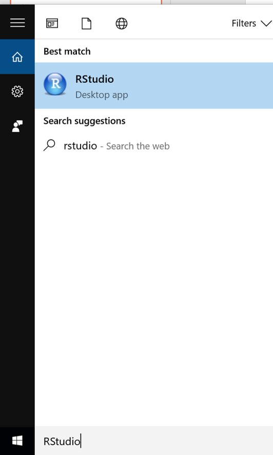

# Getting Started with RStudio

## Opening R Studio

First thing, open up R Studio!

Either find the RStudio icon on your desktop/start menu, or search for it in the start menu search (this is assuming you are using a Windows computer):

</img>

## R Studio Layout
Clink on it and the R Studio interface will open, and will look like this:
</img>

At this stage, there are three panes in an R Studio window:

* Left Panel: The console - this shows you which code you have run and any outputs you might specify, and also allows you to run lines of code which you don't need to save (e.g. to remove an object)
* Top right: The environment - this is where R Studio shows you which objects (stuff - data tables, strings, numbers, personalised functions) you have available
*Bottom right: Everything else - the help function, the place to view graphs, and the place to view which files you have available

## Setting up a project
Analysis in R is carried out in 'projects'. A 'project' creates an space which contains all of the inputs, code, and outputs that relate to the analysis.

<b>Activity A3.1:</b> Create a new project:

1. Click on File
2. Click on New Project
3. Click on New Directory
4. Click on Empty Project
5. In 'Directory name' type R_training
6. In 'Create project as subdirectory of' select a folder that you commonly use, like Documents
7. Click 'Create project'
8. Click File
9. Click New File
10. Click R Script

 

Great, we've now created a project - all pieces of analysis should start with a project.

We now need to put some stuff in it.

<b>Activity A3.2:</b> Set up your folder structure:

1. Open up your file explorer and navigate to the directory (folder) you just created in R Studio
2. Create the following folders:
    + R
    + Data
    + Outputs
    + Misc
3. Move the data you've been sent into Data.

 

We can now view this environment within R Studio - click on 'Files' in the bottom right console.

</img>