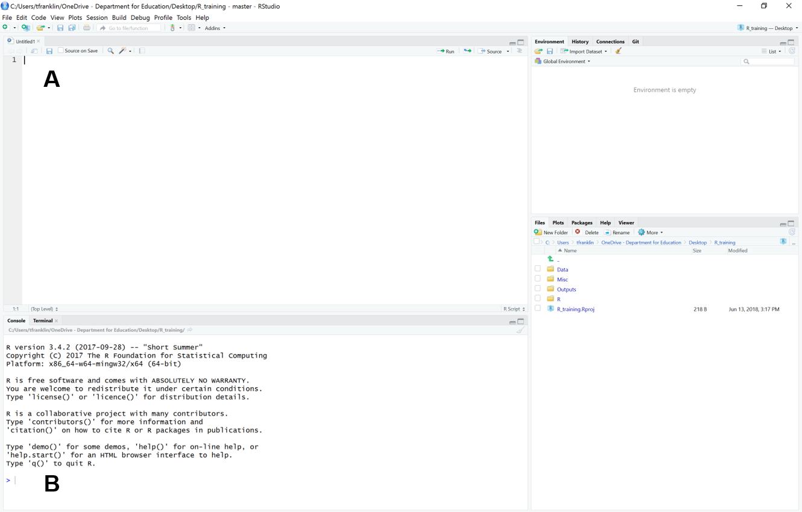
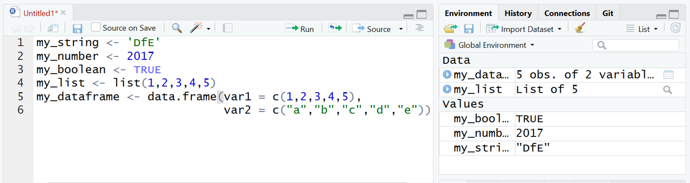

# General Coding

Below shows RStudio with two places where you can run code 

</img>

**A.** An R Script allows you to save it for future use, meaning you can use it over and over again. 

**B.** The R Console will just print the code once, not allowing you to save this for future use. 

## Objects

Objects are any 'thing' that you create in R. They're shown in your Environment.

There are a huge number of objects. The code below produces a few of these types of objects:

```{r sec3_1,eval=FALSE}
my_string <- 'DfE'
my_number <- 2017
my_boolean <- TRUE
my_list <- list(1,2,3,4,5)
my_dataframe <- data.frame(var1 = c(1,2,3,4,5),
                           var2 = c("a","b","c","d","e"))
```

The <span class="code"><-</span> sign is called a get sign. It 'gets' the output from the right hand side and attributes it to the object name.

<div class="tip"><b>Tip:</b>
ALT + - is a shortcut to inputting the get sign.
</div>
<br/>

However, we still need to run that code. You'll need to place your cursor somewhere in the line you want to run, or if it's multiple lines highlight them. To initiate the code you can:

* Press `CTRL` + `ENTER`
* Click 'Run' in the top right hand corner of the script window

In our environment in the top right hand corner, we will now have these 5 objects stored. 
</img>

<div class="tip"><b>Tip:</b>

There are a number of different ways you can write names in R:

* snake_case: lower case, separated by underscores
* CamelCase: each word starts with an upper case letter
* kebab-case: lower case, separated by hyphens
</div>
<br/>

<div class="tip"><b>Tip:</b>

* Double click highlights term
* Triple click highlights line
* Quadruple click highlights entire script
</div>
<br/>

<div class="activity"><b>Activity A3.3:</b> 
What does <span class="code">str(OBJECT NAME)</span> do?
</div>
<br/>

<div class="activity"><b>Activity A3.4:</b> 
Now save your work in the <span class="code">R</span> folder!
</div>
<br/>

Writing the following code will remove a specified object:
```{r sec3_2,eval=FALSE}
rm(object_name)
```

Writing the following code will remove all objects:
```{r sec3_3,eval=FALSE}
rm(list = ls())
```

<div class="activity"><b>Activity A3.5:</b> 
Arguments are the bits of code inside brackets, and if there are multiple arguments they're separated by commas. 

Explain the what the argument inside the second <span class="code">rm</span> in the code above does.
</div>
<br/>

## Comments

<div class="activity"><b>Activity A3.6:</b> Type <span class="code">1+1</span> and run it, what comes up in the console? Put a <span class="code">#</span> in front of <span class="code">1+1</span>, what comes up in the console?</div>

Comments are really important for annotating code, so that you and others know exactly what the code does and why.

Here we add a description of what <span class="code">setwd()</span> does:

```{r sec3_4,eval=FALSE}
#Remove all objects
rm(list = ls())
```

<div class="tip"><b>Tip:</b>

* CTRL + SHIFT + C comments multiple lines at once
* CTRL + SHIFT + R creates a section, which you can jump between using the dropdown list in the bottom left corner of the script window
</div>
<br/>

## Good coding practice 

We want to share our analysis with other R users, so it can be replicated. This needs to be as helpful as possible for other people to pick up your work. Everyone has their own style of coding, but with R and other langauges, we generally adopt a common practice to help team-working. The below style is a good starting point which will be helpful to your colleagues, but this is a very open topic which all R users have a preferred style!

**One example of helpful coding practice**

- `#` comments out a section 
- `####` is a style preference which makes a natural break for your eyeline between sections of code
- `----` tells R that this is the start of a section of analysis, and users can click on the show document outline section and move between sections 

```r
# Name of analyst, day/month/year
# Name of task e.g. Analysis of KS4 data

####
# Description of the work done
# Identifies levels of pupil absence across years
# Graphs results to see which years had highest levels of absence

####
# Pseudocode ----
# 1. Load libraries and data
# 2. Manipulate data
# 3. Graph results

####
# 1. Load data and libraries ----
library(tidyverse)
raw_data <- read.csv("my_data.csv")

####
# 2. Manipulate data ----
raw_data %>% filter(level == "NATIONAL") -> clean_data

####
# 3. Graph results ----
ggplot(clean_data, aes(x = year, y = pupil_absence)) + 
  geom_bar(stat = "identity")
```
